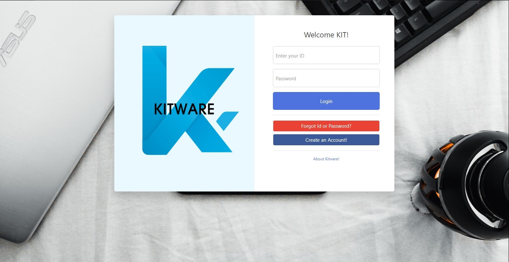
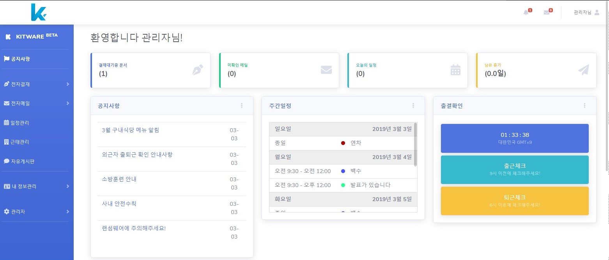
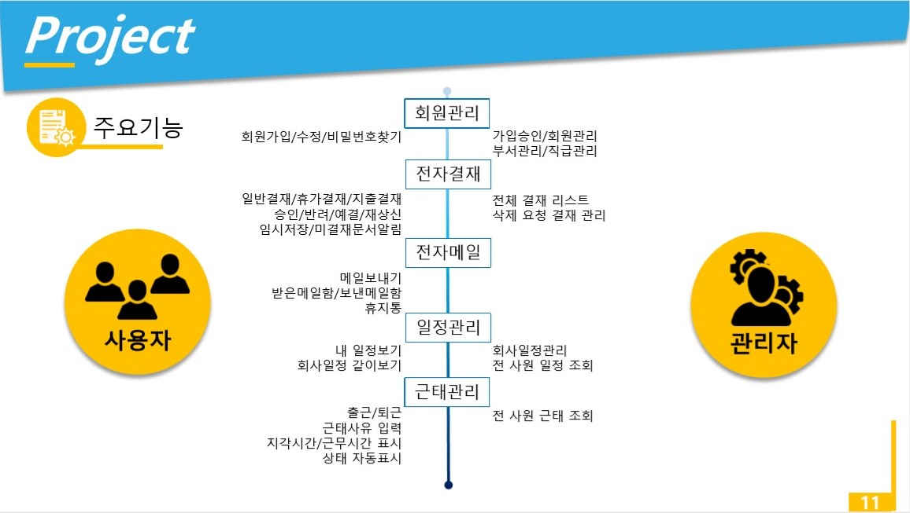

<h1>KITWARE</h1>

<h3>회사운영을 위한 그룹웨어 솔루션</h3>

2019.02.11 - 2019.03.04(개발기간:3주)

| JDK | Java 1.8.0_191 | 
|:------:|:------:|
|   DBMS    |   AWS RDS (Oracle Standard Edition)    |
|   WAS    |   Apache Tomcat 8.0.32    |
|   사용기술    |   JSP/jQuery/Ajax/JavaScript/CSS/HTML/JSON/JSTL    |
|   Framework    |   Spring/MyBatis/BootStrap    |
|   Design Pattern    |   MVC model 2    |
|   API    |   JDBC/fullcalendar/JavaMail/Google chart/SummerNote/ 다음 우편번호/Easy UI/jQuery UI    |
|   형상관리    |   Git    |
|   의존성 관리    |   Maven    |

